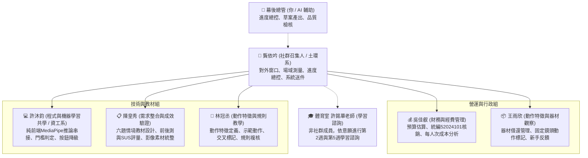

# 115-1 匹克球學生學習社群｜全體幹部與成員工作職掌手冊

> **定位**：本手冊讓每位加入社群的夥伴（包含召集、財務、教材、特徵標記、程式共學與器材管理），都能清楚知道自己「何時該做什麼、產出物要交給誰」，落實自主跨領域協作！  
> **單一真理來源**：`01_計畫申請與核銷_教發中心/01_115-1計畫申請書_退件修復完整版.md`

---

## 👥 一、 核心組織架構與分工總表 (本期 6 位正式成員)



---

## 📌 二、 六大核心職位具體工作清單 (Checklist)

### 1. 🎯 龔依吟｜社群召集人與場域規劃 (土環系)
- **核心價值**：社群的法定代表人、對外窗口與場域幾何規劃師。
- **平時職責**：
  1. 代表社群與教發中心業務承辦窗口聯繫，掌控最新時程通知。
  2. 聯繫體育室許銘華老師，協調第 2 週與第 5 週學習諮詢意願與形式。
  3. 負責計畫申請書、期末結案報告書與核銷單據之簽名確認。
  4. 發揮土環系測量專長：規劃鏡頭距離（1.8~2.2米）、拍攝角度、站位標線與動線，記錄光線條件與辨識失敗對照。
- **聚會與期末任務**：
  - 主持 7 次共學聚會，確認每次達三分之二以上法定出席率。
  - 代表社群出席教發中心「期末成果發表會」，進行 5~8 分鐘簡報。

---

### 2. 💰 吳佳叡｜財務與經費管理 (財經系)
- **核心價值**：掌管 8,000 元經費預算，確保每一分錢 100% 合規實報實銷。
- **日常例行任務**：
  1. 統籌管理基本補助 8,000 元（材料費上限 5,600 元，誤餐費上限 2,400 元至多 24 人次）。
  2. 採購消耗品（戶外球、握把布、定位膠帶、表單印製）或便當時，結帳**務必打上統編 `52024101`**。
  3. 結帳**當天立刻拍照**單據上傳雲端硬碟，檢查有無統編與明確品名明細（禁止「文具一批」）。
  4. 每次申報誤餐費，務必檢附當次正式聚會「成員親自簽到表影本」。
- **期末核心產出**：
  - 產出《逐項預算估算表》、《採購與庫存核對表》、《去識別化支出核銷紀錄冊》與《每人次體驗成本簡析報告》。

---

### 3. 📋 陳皇秀｜需求整合與成效驗證
- **核心價值**：將運動心理學與規則痛點轉譯為教學需求，主導體驗成效驗證。
- **日常任務**：
  1. 規劃發球、兩跳原則、非截擊區六題情境教材與易錯觀念解說。
  2. 建立 30 人次新手測試之單組前後測題本與標準十題 SUS 使用性量表。
  3. 落實人工智慧倫理：鏡頭使用同意書、匿名編碼（`SUB-01` ~ `SUB-30`）與資料最小化。
  4. 統整 7 次聚會側拍照片與錄影片段，維護影片素材索引表。
- **期末核心產出**：
  - 交付六題功能查核表、有效前後測配對數據、SUS 分析圖表與 3~10 分鐘 1080P 成果影片剪輯。

---

### 4. 🏸 林冠丞｜動作特徵與規則教學
- **核心價值**：運動規則專業把關與動作特徵拆解。
- **日常任務**：
  1. 從現場示範與教學經驗出發，將揮拍動作拆解為「相對位移」與「肘角」等可觀察、可重複標記之特徵。
  2. 示範指定揮拍與非目標動作，與王雨欣進行片段交叉標記並討論分歧。
  3. 向程式組說明特徵代表之教學意義與誤用風險（明確聲明非比賽裁判、不辨識球網與出界）。
  4. 複核六題情境教材之官方規則條文依據。
- **期末核心產出**：
  - 交付動作觀察表、兩位標記者差異與討論紀錄、六題教材規則複核紀錄。

---

### 5. 📦 王雨欣｜動作特徵與學習觀察
- **核心價值**：動作資料標準化採集、器材管理與新手學習觀察。
- **日常任務**：
  1. 保管社群公用 8 支球拍與 2 組球網，維護《器材借還紀錄表》。
  2. 於固定鏡頭位置與固定光線下，與林冠丞共同進行 80 次動作片段標記與覆核。
  3. 觀察新手在六題情境作答與體感操作時的卡關反應，轉譯為題目修訂建議。
  4. 協助聚會現場照片側拍與成員個人訪談錄製。
- **期末核心產出**：
  - 交付動作標記表、標記差異紀錄、至少一輪題目或提示修訂紀錄。

---

### 6. 💻 許沐鈞｜程式與機器學習共學 (資工系)
- **核心價值**：探索 MediaPipe 姿態估計於瀏覽器端 Edge Computing 之落地實作。
- **研發任務**：
  1. 使用 Google MediaPipe Pose Landmarker 現成模型，於純前端進行肩、肘、腕節點取樣。
  2. 將手腕位移依肩寬進行尺度歸一化，實作相對位移門檻與 0.5 秒冷卻防抖邏輯。
  3. 與陳皇秀結對開發六題教材互動網頁，確保支援純按鈕安全降級備援。
  4. 記錄跨裝置推論 FPS 與模型限制，維護 GitHub 原始碼與版本紀錄。
- **期末核心產出**：
  - 交付教學網頁開源原始碼、輸入特徵說明、人工標記對照表及模型限制筆記。

---

## 📅 三、 7 週 7 次聚會執行時間軸一覽

```text
第 1 週 (10/12–10/18) ──► 聚會 1：需求與現況盤點 (2hr)｜確認名冊、實測V4/V5、六題規格
第 2 週 (10/19–10/25) ──► 聚會 2：動作觀察與規則轉譯 (2hr)｜特徵交叉標記、第1輪學習諮詢
第 3 週 (10/26–11/01) ──► 聚會 3：六題教材及技術共學 (2hr)｜按鈕版教材實作、耗材採購
第 4 週 (11/02–11/08) ──► 聚會 4：鏡頭輸入與內部驗證 (2hr)｜節點整合、跨裝置測試、凍結功能
第 5 週 (11/09–11/15) ──► 聚會 5：體驗演練與流程整備 (2hr)｜內部分站演練、第2輪學習諮詢
第 6 週 (11/16–11/22) ──► 聚會 6：第一場新手體驗與檢討 (3hr)｜分站實測約15人次、即時檢討
第 7 週 (11/23–11/29) ──► 聚會 7：第二場新手體驗與總結 (3hr)｜再測約15人次、累計30人次目標
結案緩衝 (11/30–12/25) ─► 數據統計圖表、剪輯1080P影片(含6人心得)、經費核銷報帳、出席發表會
```
