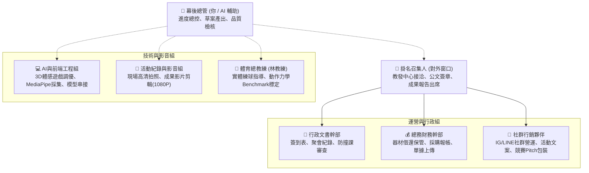

# 115-1 匹克球社群 ＆ 創發計畫｜全體幹部與成員工作職掌手冊

> **定位**：本手冊讓每位加入社群的夥伴（無論是行政、行銷、技術、總務或一般社員），都能清楚知道自己「何時該做什麼、產出物要交給誰」，拒絕模糊推諉，實現輕鬆自主協作！

---

## 👥 一、 核心角色職責與分工總表



---

## 📌 二、 各職位具體工作清單 (Checklist)

### 1. 🎯 掛名召集人 (Convener / PM)
- **核心價值**：社群的法定代表人與對外窗口。
- **平日職責**：
  1. 代表社群與教發中心業務承辦窗口聯繫，接收最新公文通知。
  2. 與指導顧問（體育室許銘華老師）保持聯繫，確認指導時程。
  3. 計畫申請書、期末結案報告書、經費核銷黏存單親自用印或簽名。
  4. 召開每週/隔週實體練球活動，擔任開場與暖場。
- **期末關鍵任務**：
  - 代表社群出席 12 月教發中心主辦之「期末成果發表會」，進行 5~8 分鐘簡報。

---

### 2. 📝 行政文書幹部 (Administration & Documentation)
- **核心價值**：社群運作的守護神，確保所有校方規章程序 100% 合規。
- **每次聚會三部曲**：
  - **聚會前**：印出紙本「聚會簽到表」，提醒大家攜帶學生證或學號。
  - **聚會中**：確實督促每位到場成員親自簽名（不得代簽），清點出席人數。
  - **聚會後 48 小時內**：將簽到表拍照/掃描，並在 Google Drive 填寫完成該次「教發中心聚會討論紀錄表」（套用標準模板），上傳雲端硬碟。
- **學期重大任務**：
  - 開學初收集 5~10 位成員修課清單，確認無衝堂問題。
  - 10/02 前協助召集人在教發系統送件。
  - 12/25 前統整 6 次紀錄表，彙整成期末結案報告文字檔。

---

### 3. 💰 總務財務幹部 (Finance & Logistics)
- **核心價值**：掌管錢袋子與器材物資，保證每筆經費都能實報實銷。
- **日常例行任務**：
  1. **器材管理**：保管 2 組 5 米球網、8 支球拍與比賽球；每次練球前攜帶至場地，練球後清點數量。
  2. **場地協調**：提早於系統或向體育室預約惠蓀堂旁匹克球場。
- **經費核銷任務**：
  1. 採購消耗品（比賽球、握把布、白貼）或訂便當時，結帳**務必輸入統編 `52003803`**。
  2. 結帳**當天立刻拍照**上傳至 Google Drive `02_總務器材組/發票收據拍照上傳區/`。
  3. 保管發票正本，於 11/30 前填寫教發中心「支出黏存單」，附上便當簽到名冊送審。

---

### 4. 📢 社群行銷與推廣夥伴 (Marketing & Community Lead)
- **核心價值**：將社群好玩的成果傳遞出去，吸引跨系新血，為競賽打造爆款 Pitch！
- **日常任務**：
  1. **Instagram 粉專運營**：每週/隔週發布練球動態、限時動態、球技教學小短片。
  2. **官方 LINE 帳號管理**：維護圖文選單 6 宮格，定期推播活動訊息。
  3. **校園社群曝光**：於 Dcard 中興版、系所大群轉發好玩親民的招募文案。
- **競賽衝刺任務**：
  - 協助 3 萬元創發競賽進行商業簡報（Pitch Deck）視覺排版與痛點包裝。

---

### 5. 💻 AI 體感與網頁前端工程組 (Tech & AI Lead)
- **核心價值**：持續調優 3D 體感遊戲系統，把課堂所學（TAICA 李宏毅老師課程、Three.js）實際落地。
- **研發任務**：
  1. **體感捕捉調優**：優化 MediaPipe Pose 33 關節點，解決高速揮拍殘影問題。
  2. **資料標註與採集**：配合林教練的高速影像錄影，抽取揮拍序列資料庫。
  3. **GPU 算力串接**：使用 GPUtw.ai 平台微調動作分類評分模型，導出輕量化 ONNX。
  4. **網頁介面維護**：維護 GitHub Pages 程式碼與學號去識別化登入功能。

---

### 6. 🎥 活動紀錄與影音剪輯組 (Media Lead)
- **核心價值**：為團隊留下精彩回憶，主導期末評鑑最關鍵的成果影片！
- **每次聚會任務**：
  - 攜帶相機或高階手機，拍攝現場學員揮拍、對打、指導的動態高清照片（每次至少 4~6 張）。
  - 將原始照片檔案分類存放至 Google Drive 雲端相簿。
- **期末核心產出**：
  - 依照「4 幕分鏡腳本大綱」，剪輯一部 **3~10 分鐘、1080P** 的高畫質成果分享影片（含片頭、練球精華、全員個人心得採訪、期末謝幕）。

---

### 7. 🏸 體育訓練組長 / 總教練 (林冠辰 教練)
- **核心價值**：運動科學與擊球技術權威指導。
- **指導任務**：
  1. 制定 6 次練球技術課表（持拍、步伐、廚房區截擊、第 3 拍落點）。
  2. 擔任 AI 體感標準動作的示範者（Benchmark Standard）。
  3. 期末組織社群內部分級雙打友誼賽。

---

## 📅 三、 跨學期執行時間軸一覽

```text
學期初 (9月 ~ 10月初) ───► 成員招募、資格查核、雙軌送件 (9/22 創發 / 10/02 社群)
學期中 (10月中 ~ 11月) ──► 6次實體聚會、耗材採購即時拍照、高速動作數據採集
11月底 (11/30) ────────► 經費核銷截止 (發票整理黏存、簽名送教發審查)
學期末 (12月) ─────────► 成果影片粗剪 (3-10分)、海報輸出、期末成果發表會簡報
```
