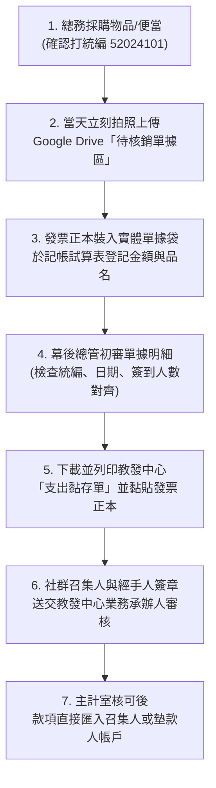

# 中興大學教發中心計畫｜經費核銷標準作業程序 (SOP) 與防呆手冊

> **適用計畫**：115-1 學生學習社群計畫（滿額 10,000 元）  
> **核心目標**：杜絕發票開錯、被主計室退件、或是個人墊款拿不回來的慘劇！

---

## 📌 一、 經費核銷核心基本資料 (防呆第一線)

- **中興大學統一編號**：`52024101`（請在手機備忘錄或 LINE 釘選，買任何東西前先亮出來）
- **買受人抬頭**：國立中興大學
- **計畫經費主管機關**：中興大學教學資源暨發展中心（教發中心）
- **核銷截止死線**：**115 年 11 月 30 日前**（發票日期必須在計畫核定日 ～ 11/30 之間，不可早於核定日！）

---

## 🧾 二、 各類發票與收據之正確開立規範

| 發票/收據種類 | 正確開立規範 (必備條件) | 常見致命錯誤 (被退件原因) |
| :--- | :--- | :--- |
| **二聯式收銀機發票** (超商、超市、一般店家長條紙) | 必須在結帳前告知店員輸入統編 `52024101`，印出之發票上必須有統編號碼。 | 漏打統編、手寫補填統編未蓋店家發票專用章。 |
| **電子發票證明聯** (熱感應紙，如全家/全聯/大潤發) | 1. 統編 `52024101` 2. **必須列印「交易明細」**（熱感應發票若無明細無法報帳！）。 | 只有發票本身，沒有明細紙（主計無法判定買了什麼）。 |
| **三聯式統一發票** (手寫複寫紙，如文具行、體育用品社) | 1. 抬頭：國立中興大學 2. 統編：`52024101` 3. 扣抵聯、收執聯需一併附上 4. 品名、數量、單價、總計大寫無誤。 | 抬頭寫錯（如寫成「匹克球社」）、未蓋發票專用章、塗改處未加蓋負責人小章。 |
| **免用統一發票收據** (便當店、小吃攤、傳統印刷廠) | 1. 抬頭：國立中興大學 2. 統編：`52024101` 3. 右下角必須蓋：**「免用統一發票專用章（含統一編號）」** 4. 負責人私章。 | 只蓋負責人私章卻沒有店家統編章、品名模糊寫「便當一批」。 |

---

## 🍱 三、 研習誤餐費（便當/餐點）專屬核銷三大要件

> 根據學校規定，誤餐費上限為計畫總金額之 30%（1 萬元計畫上限 3,000 元，約 25~30 個便當）。

1. **時間要件**：
   - 聚會練球時間必須**跨越用餐時段**（如：上午 10:00 ~ 13:00，或下午 16:30 ~ 19:00）。
2. **單據要件**：
   - 便當發票或免用發票收據上，必須清楚列出「便當單價」與「數量」（如：招牌排骨飯 100元 × 8個 = 800元）。
   - **單價上限**：每人每餐原則上以 100~120 元為限，禁止購買飲料、下午茶甜點報支誤餐。
3. **佐證名冊（最常被退件！）**：
   - 每次報支誤餐費，**必須檢附該次聚會之「簽到名單」**（幾個人簽到就只能報幾個便當，簽到 6 人卻報 8 個便當會被主計剔除！）。

---

## 🏸 四、 消耗性器材、儲存耗材與展示海報報支須知

- **器材耗材 ($4,000)**：
  - 40孔戶外標準比賽球、拍柄握把布、運動白貼與冰敷包。
  - 結帳務必打統編 `52024101`，品名不可寫統稱「文具一批」或「體育用品一批」，需列出品名細項。
- **數據儲存耗材 ($1,800)**：
  - 高速 MicroSDXC 記憶卡（SanDisk Extreme 128GB 等），附購買發票與規格明細，供高速攝影動作特徵點資料存檔。
- **成果展示海報印刷 ($1,200)**：
  - 期末成果發表會直立式海報大圖輸出與展架。
  - 核銷憑證：印刷廠/影印店發票（統編 `52024101`），並檢附期末展覽現場海報實體照片佐證。

---

## 📋 六、 發票單據黏存單製作與核銷流程（Step-by-Step）

### 💡 總務與行政必備防呆檢查清單：
- [ ] 發票上有沒有打統編 `52024101`？
- [ ] 如果是熱感應紙發票，有沒有附上**交易明細清單**？
- [ ] 買便當的日子，有沒有對應的**簽到表影本**？便當數量有沒有超過簽到人數？
- [ ] 發票日期有沒有在**核定日之後、11月30日之前**？
- [ ] 發票正本有沒有妥善保管在實體資料夾中（不可有破損或油漬模糊字跡）？
