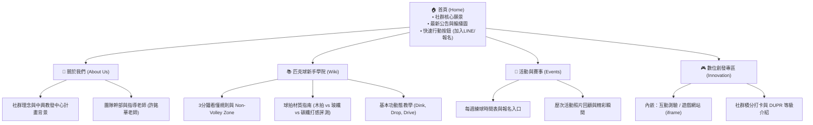

# Google Sites 官方網站｜架構 Sitemap 與內容規劃

> **定位**：社群的「官方數位門面」與「永久知識庫 Wiki」。不必頻繁修改，建立後即可長期作為信任背書與教學沉澱。

---

## 一、 網站階層結構 (Sitemap)

---

## 二、 首頁 Hero 區塊核心文案

- **主標題**：跨越球場的界線，找到你的揮拍節奏！
- **副標題**：國立中興大學學生學習社群｜結合運動科學、器材實測與友善新手的匹克球推廣平台
- **CTA 按鈕**：
  1. [立即加入 LINE 掌握練球動態]
  2. [探索新手指南]
